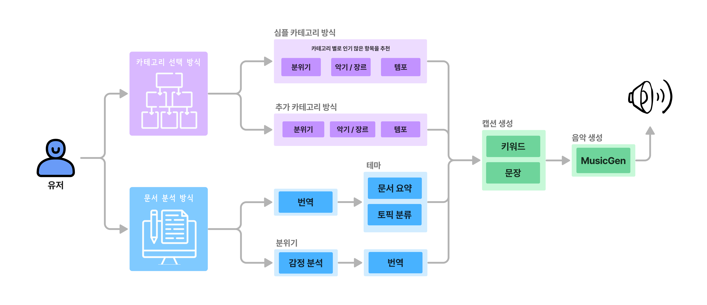
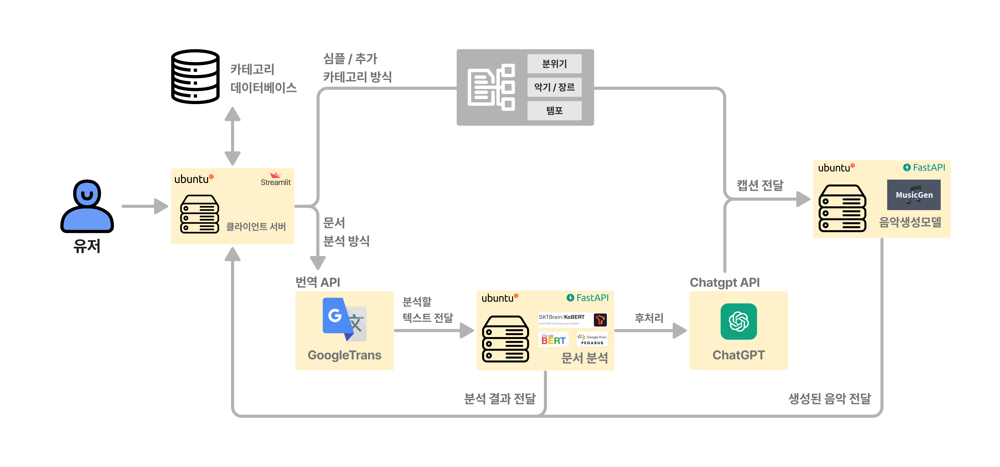

 


  

# TexTuneS

누구나 쉽고 간단하게 적합한 나만의 배경 음악을 만들어 제공해주는 웹서비스 입니다.  
[발표 자료](assets/final_project_Presentation.pdf) |
[개인 랩업 리포트](assets/final_wrapup_report.pdf) |
[발표 영상](https://youtu.be/LWodtP5Kh6Q) |
[데모 사이트](http://101.101.209.53:30007/)

## 프로젝트 소개

### 크리에이터를 위한 맞춤형 음악 생성 서비스

배경음악은 우리가 의식하지 않아도 우리의 감정, 사고, 행동을 조정하는 힘을 가지고 있으며 다양한 경험들 속에서 영향력을 끼치고 있습니다.

또한 다양한 컨텐츠 속에서 배경음악은 이미 많이 활용되고 있으며, 이는 더 대상에 관심을 가지게 하며 상황에 더 몰입할 수 있는 환경을 제공하고 있습니다.

**TexTunes**는 **다양한 컨텐츠에 적합하게 활용할 수 있는 배경음악**을 만들고 싶은 모든 크리에이터들을 위해 누구나 **쉽고** **간단**하게 나만의 맞춤형 배경음악을 만들어주는 경험을 제공합니다.

음악 생성 모델을 활용하여 배경음악을 만들고 **더 완성도 높은 컨텐츠**를 만들어 보세요.


## 프로젝트 역할
### Boostcamp AI-Tech 5기 NLP-01조 자만추

| 팀원                                              | 작업                                                                                  |
| ------------------------------------------------- | ------------------------------------------------------------------------------------- |
| [김효연\_T5072](https://github.com/Broco98)       | Streamlit 프론트엔드, llama2 모델 구현 및 프롬프트 엔지니어링                         |
| [서유현\_T5107](https://github.com/a-Tachyon)     | 데이터 수집, 음악 생성 모델 구현 및 fine tuning 등 성능 개선                          |
| [손무현\_T5114](https://github.com/MuHyeonSon)    | 데이터 수집, 음악 생성 모델 조사 및 음악 생성 서버 구축, 카테고리 정의 및 데이터 구축 |
| [이승진\_T5144](https://github.com/MonteCarlolee) | 생성 요약 모델 연구 및 논문 구현                                                      |
| [최규빈\_T5215](https://github.com/gyubinc)       | 토픽 모델링, 장르 classification 모델 구현                                            |
| [황지원\_T5231](https://github.com/Jiwonii97)     | PM, Streamlit 프론트엔드, 음악 도메인 감정모델 연구 및 서빙                           |

### 프로젝트내 역할
1. 프로젝트 매니저 (Project Manager, PM)
    - 전체 프로젝트의 계획을 설계 및 수립하고 전체적인 아키텍처 구조 및 개발 프로세스 설정을 담당하였습니다. 
    - 또한 스트린트마다 개발과정에서 발생하는 이슈에 대해 피드백을 진행하며 문제를 해결해 나갔습니다.QA를 담당하여 서비스 사용자로 하여금 의견을 받고 정리하는 역할을 맡았습니다.
2. 웹 클라이언트 서버 개발
    - Streamlit을 통한 프론트 웹 개발을 진행하였습니다.
    - 유저가 입력하는 정보를 받아 각 모델 서버에 전달하고 결과를 다시 유저에게 반환해주도록 개발을 진행하였습니다. 
    - AWS EC2와 S3와 같은 클라우드 서비스와의 연결을 시도하였습니다.
3. 음악 도메인 특화 감정 분석 모델 개발 및 서빙
    - 이전에 진행해본 감정 분석 모델을 더 발전시켜 음악 도메인 특화 감정 분류 모델 학습을 진행하였습니다. 
    - 이를 바탕으로 유저가 입력한 텍스트를 통해 음악 생성에 필요한 키워드를 추출하도록 서빙을 진행하였습니다.

## 개인회고
### 이번 프로젝트에서 나의 목표
- PM으로서 프로젝트 목표와 계획을 수립하고 피드백을 이어가며 실제 서비스 배포를 해보자
    - PM으로서 프로젝트 목표를 달성하기 위해 한주를 스프린트로 잡아 프로젝트 계획을 진행하였습니다. 또한 배포와 QA 기간을 미리 설정하여 원하는 기간내에 프로젝트를 완성할 수 있도록 목표를 잡았습니다. 그 결과 1차 배포를 기간내에 진행할 수 있었고 추가로 유저 설문을 통한 QA 또한 받아 서비스 피드백을 받을 수 있었습니다.
    - 개발 초반에는 Git, Slack, Figma와 같은 협업 툴을 적극 활용하여 팀원과의 소통을 더 활성화 하고자 하였습니다.
    - 프로젝트 외에도 매일 피어세션 시간동안 피드백을 통해 서비스 품질을 올리고자 하였고, 업무를 분담하여 진행할 수 있도록 하여 더 효율적인 작업을 할 수 있었습니다.
    - 하나의 서버에서 모든 프로세스가 돌아가는 것이 아니 MSA 구조를 바탕으로 서버 각각에 모델을 두고 서로 API를 통해 주고받을 수 있도록 설계하였습니다.
    - 피드백을 통해 얻은 데이터는 팀원들과 협의를 통해 추가적으로 조정해 나갈 계획입니다. 
- 애자일(Agile) 모델 개발 프로세스를 바탕으로 실제 서비스 개발을 진행해보자
    - 기존의 폭포수(Downfall) 모델은 기획부터 설계, 개발까지의 과정이 길고 완성하기까지 결과물을 예측할 수 없다는 단점을 가지고 있습니다.
    - 이에 애자일(Agile) 모델 참고하여 유저 서비스를 위한 기능 구현을 우선으로 하고자 하였고, 스프린트 계획하에 작업을 진행하였습니다.
    - 그 결과 각 Task 별로 작업을 나눠할 수 있었고, 업무 분담이 더 잘 이뤄졌던거 같습니다.
    - 또한 유저의 피드백을 지속적으로 받아 에러 부분에 대해서는 핫픽스(Hotfix)로 수정하며 완성도 높은 프로젝트를 목표로 하였습니다.
- 서비스 배포를 하면서 QA를 통해 직접 유저의 피드백을 받아보자
    - 실제 개발자가 서비스를 만들면서 보이지 않는 부분들이 있고, 이는 다양한 시각에서 보게 된다면 쉽게 발견할 수 있다고 생각합니다. 
    - 이에 다양한 의견과 피드백을 통해 서비스 완성도를 높이기 위해 QA를 진행했었습니다.
    - QA의 경우 유저 설문을 통해 리서치를 모으고 결과를 바탕으로 서비스 개선을 위해 우선적으로 진행해야 할 점들에 대해 생각할 수 있었습니다.
- “음악 생성” 이라는 도메인에 특화된 모델 연구를 진행해보자
    - 이전에도 감정 분류같은 연구는 몇번 경험했었지만, 음악이라는 특정 도메인에 특화된 연구는 진행해본적은 없었습니다.
    - 음악은 단순한 텍스트 분석이라고 보기는 어려웠고 음악을 통해 사용자가 느끼는 감정을 표현하는 지표는 쉽지만은 않았습니다. 
    - 이에 관련 문헌이나 논문을 찾아보고 Arousal, Valence와 같은 요소를 적용한 새로운 지표를 설계하고 이를 바탕으로 추가 모델 개발을 진행하였습니다.
    - 이렇게 기존의 모델들을 실제 서비스에 접목하기 위한 노력이 매우 큰 도움이자 경험이 되었다고 생각합니다. 
- 추가적으로 모델 성능 개선을 위해 다양한 인사이트를 탐색해보자
    - 감정 분류 모델, 음악 생성 모델 모두 이전에는 경험해보지 못한 내용들을 포함하고 있어 어려운 부분들이 있었습니다. 
    - 이에 더 많은 자료를 참고하여 개발을 진행하기 위해 모델을 서칭하고 논문을 찾아봤던거 같습니다.
    - 이는 성능 개선 또한 개발을 위한 서칭(Searching)을 통해 모델을 고도화 하고자한 또 다른 경험이 되었다고 생각합니다.

### 이번 프로젝트의 새로운 시도
- 이번 최종 프로젝트의 경우, 팀 내부적으로 개발 경험이 많지 않아 제가 주도적으로 진행해야겠다는 생각을 했고 많은 부분에서 피드백도 주고 의견도 표출하며 프로젝트 전반에 신경을 썼던거 같습니다.
- 이전에는 모델 개선만을 목표로 했다면 이제는 이런 모델을 실제 유저에게 서비스로 제공하는 방법을 직접 체험해보는 경험을 할 수 있었습니다.
- QA를 목표로 유저 데이터를 수집해 더 개선된 서비스를 만들고자 하였습니다.

### 이번 프로젝트의 한계점
- 대부분 프로젝트 결과에는 만족하지만 중간에 발생한 트래픽 이슈가 컸던거 같습니다. 처음에는 AWS EC2 인스턴스에 서비스 배포를 진행하였으나 리소스 한계로 다른 서버로 옮겨야 했고 이 부분이 다소 아쉽게 느껴졌고 좀더 비용적인 측면을 고려해야 했나라는 생각을 했습니다.
- 개발기간이 생각보다 짧아 유저 피드백을 다 수용하지 못한점이 아쉬웠습니다.
- Streamlit을 활용한 부분에서 UI를 표현하는데 몇몇 제약이 있던 부분이 아쉽게 느껴졌습니다.


---
### 서비스 구성도


---
### 서비스 아키텍처


## Directory Tree

```
├── README.md
├── appspec.yml
├── fastapi # test server
│   └── main.py
├── requirements.txt
└── streamlit
    ├── assets
    │   ├── category_ver1.0.3.json
    │   ├── extra_exam.png
    │   ├── main_image.png
    │   ├── music_icon.png
    │   ├── page_icon.png
    │   ├── secret.json # secret
    │   ├── sidebar_img.png
    │   ├── simple_exam.png
    │   ├── test_music.wav
    │   └── text_exam.png
    ├── constraints
    │   ├── COMPONENT.py
    │   ├── INFO.py
    │   ├── PATH.py
    │   ├── SECRET.py
    │   └── TAG.py
    ├── demo
    │   ├── # 데모 노래
    ├── main.py
    ├── models
    │   └── Content.py
    ├── pages
    │   ├── 01_Simple_Category.py
    │   ├── 02_Extra_Category.py
    │   └── 03_Text_Analysis.py
    └── utils
        ├── api.py
        ├── attribute.py
        ├── config.py
        ├── generator.py
        └── log.py
```

## 참고 사이트

음악 생성 API: <https://github.com/boostcampaitech5/level3_nlp_productserving-nlp-01-1>  
문서 분석(문서 요약, 토픽 분류, 감정분석) API: <https://github.com/boostcampaitech5/level3_nlp_productserving-nlp-01-2>


